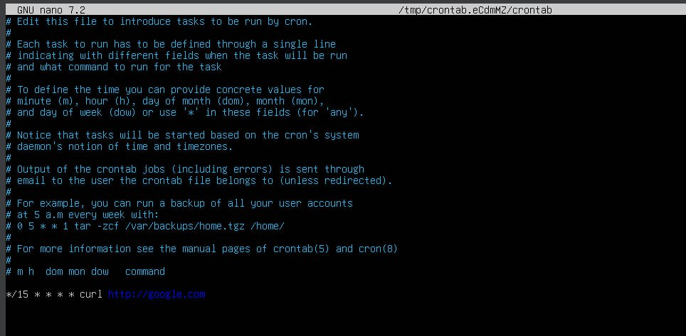
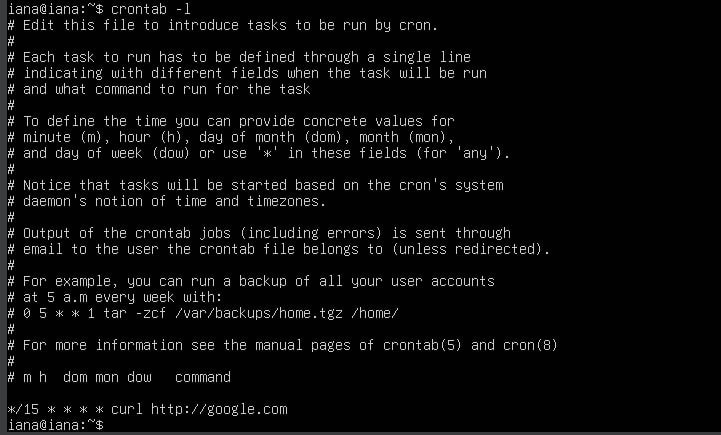
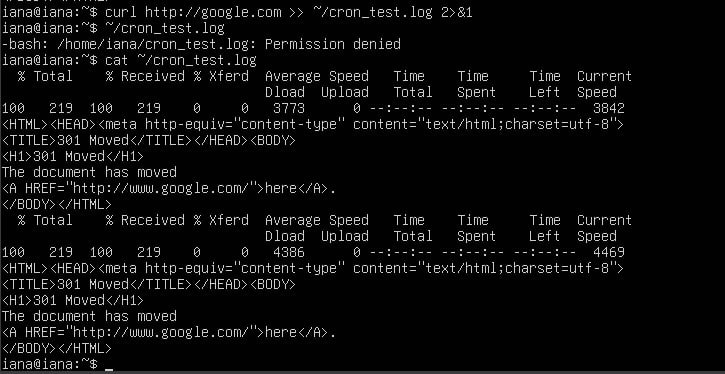
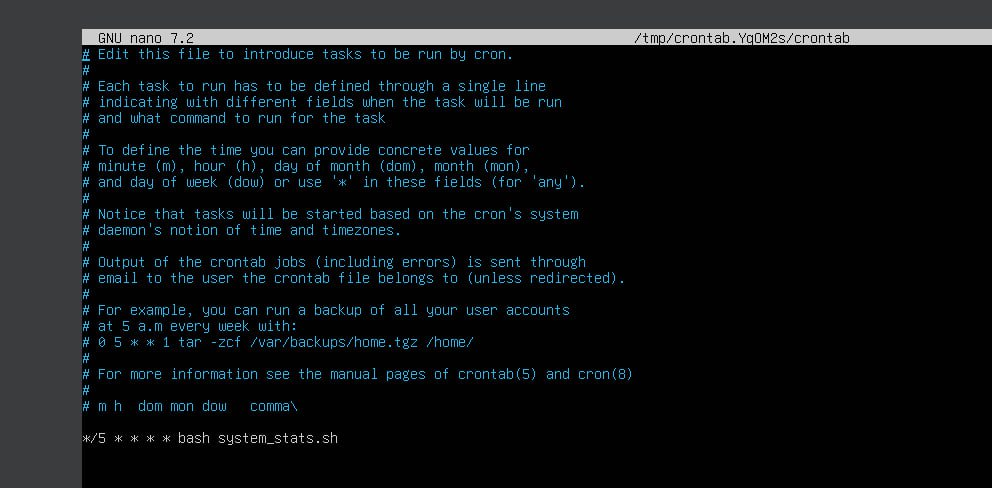
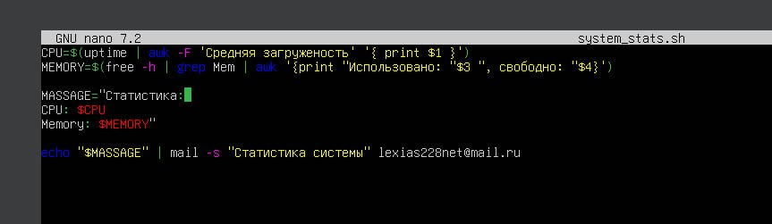
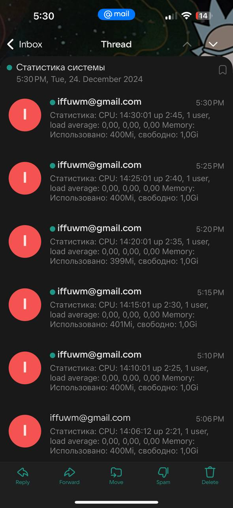
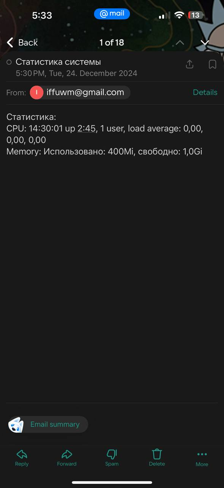

# Репорт по лабе:

## по заданию 1 вот скрины сделайнной работы:

crontab -e


crontab -l


вывод логов


## скрины по 2 задаче:

настройка crontab`a


настройка скрипта для отправки


скрины что письма приходят и в целом видно что информация в письмах разная


вот сообщение 



### Объяснения как и что я делала:

1. Читала хабр смотрела видео на ютубе и читала вики
2. Задание 1. Я шла по примеру из лаб, сначала теоретическая-практика что и описано в readme файле к лабораторной, а потом уже второе задание для практики студентов
3. В задании 1 я выбрала самую простую функцию ```curl``` для того чтобы показать что такое cron и как вообще он работает, студентов предстоит настроить cron подождать 15 минут/или запустить самостоятельно и проверить по логам что cron проходит

4. Задание 2. Я подумала и решила что отправка письма на почту с какой-нибудь информацией это интересная задумка. В ходе выполнения задания студентам надо будет разобараться с:
   * SMTP-клиентом - msmtp для подключения к почте 
   * mail - программой для работы с электронной почтой
   * Повторной настройкой cron 
   * grep - для получения значений по оперативке
   * uptime - для получения значений по CPU
